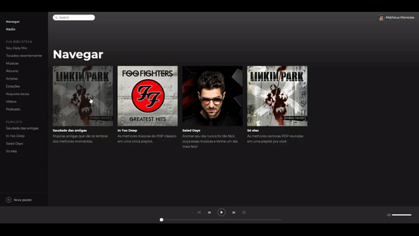

  
  
  <h2> My30Spotify </h2>

---

# 👨🏻‍💻 Introduction

## Objective

Learn about Redux and Redux-Saga with ReactJs.

## This repository has

Clone of Spotify with:

- Static json-server with some music.
- Player music.

## Project

This project was done through a module of the [Rocketseat](https://rocketseat.com.br/) course.

  

# 🚀 Technologies used

- [ReactJs](https://reactjs.org/)
- [RC-Slider](https://www.npmjs.com/package/rc-slider)
- [React-Sound](https://www.npmjs.com/package/react-sound)
- [Redux](https://redux.js.org/)
- [React-Redux](https://react-redux.js.org/)
- [Redux-Saga](https://redux-saga.js.org/)
- [Styled-Components](https://styled-components.com/)
- [Reactotron](https://github.com/infinitered/reactotron)

---

Made by Matheus Menezes Manfrin 🦥 [See my LinkedIn](https://www.linkedin.com/in/matheusmmm/)
